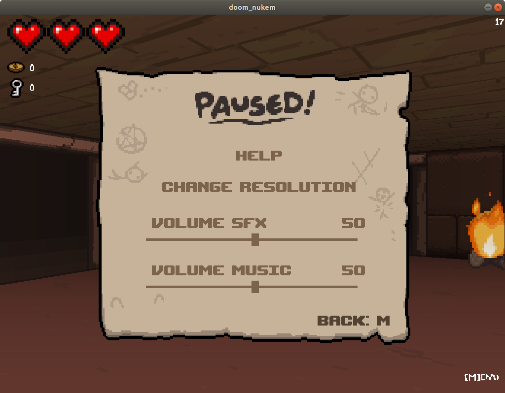

# Doom Nukem

Doom Nukem is a project that is a mix between Doom and Duke Nukem 3D. The project's goal is to create the realistic 3D graphic representation that you would have from a subjective view within a maze, using ray-casting to achieve that. No hardware acceleration and no 3D library are used.

This project was realised with [pasosa-s](https://github.com/pasosa-s), neil and brume.

## Our project

Instead of going for a Doom or Duke Nukem 3D clone, we choose to call our project *The Binding Of Isaac 3D*. By using some sprites from *The Binding of Isaac: Rebirth* game and re-drawing some other ones from scratch, we tried to envision what this top-down game, using two-dimensional sprites, would look like in 3d. Our game is in no way a clone of the original title, but simply a tribute to it.

This project is an evolution of our first program : [Wolf3d](https://github.com/JulienMousset/Wolf3d).

## How to use

In order to successfully compile our program, you will need to install the following SDL2 packages :
- libsdl2-dev
- libsdl2-image-dev
- libsdl2-mixer-dev
- libsdl2-ttf-dev

Then :
- Compile : `make`
- Remove object files : `make clean`
- Remove object files and program : `make fclean`
- Start fresh and re-compile : `make re`

## Executing

Execute the program this way : `./doom-nukem` or directly with the map of your choice like this : `./doom-nukem maps/level_1`.
You can create your own map or play with one of our own three levels that are in the `maps` folder.

There is an in-game editor that you can access through the game main menu, allowing you to edit or create maps.
If you want to edit a specific map, you can do it in-game or by using the `--editor` command this way : `./doom-nukem --editor maps/level_3`.

Have fun!

## Warning

This project was orginally started on Mac OS at our school, but was finished on Linux from home during the quarantine due to the Coronavirus COVID-19. It runs perfectly on Linux, but might not work on Mac OS.

If you are a Mac user, you can still give it a try since our Makefile is compiling either a Linux or a Mac OS version depending on the machine you are using. You might be met with some compiling issues with SDL2 frameworks and have some in-game problems like color inversion, but feel free to give it a try. I don't have a Mac OS so I don't feel like working on those compatibility issues, but don't hesitate to hit me up if you are trying to make it work and need help in the process.

## Screenshots

